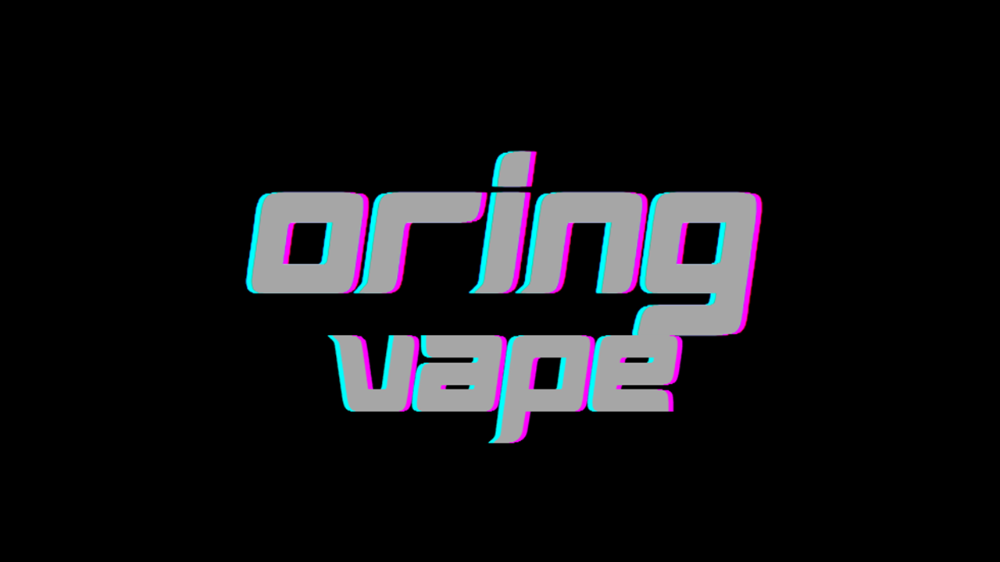
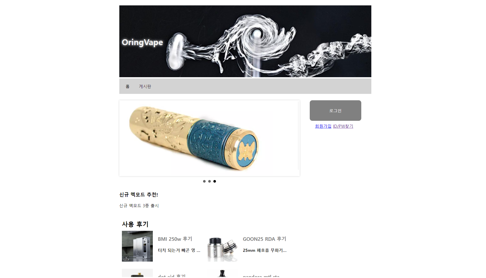
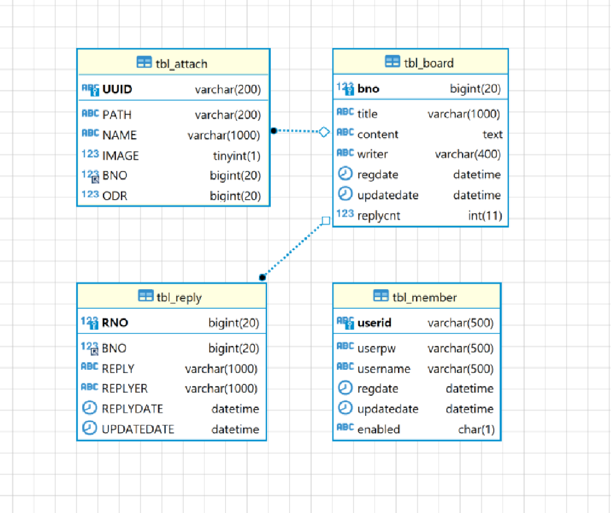

<!-- Improved compatibility of back to top link: See: https://github.com/othneildrew/Best-README-Template/pull/73 -->
<a name="readme-top"></a>
<!--
*** Thanks for checking out the Best-README-Template. If you have a suggestion
*** that would make this better, please fork the repo and create a pull request
*** or simply open an issue with the tag "enhancement".
*** Don't forget to give the project a star!
*** Thanks again! Now go create something AMAZING! :D
-->


<!-- PROJECT SHIELDS -->
<!--
*** I'm using markdown "reference style" links for readability.
*** Reference links are enclosed in brackets [ ] instead of parentheses ( ).
*** See the bottom of this document for the declaration of the reference variables
*** for contributors-url, forks-url, etc. This is an optional, concise syntax you may use.
*** https://www.markdownguide.org/basic-syntax/#reference-style-links
-->

<!-- PROJECT LOGO -->
<br />
<div align="center">
  <a href="https://pf2.chanyongyang.com/">
    
  </a>

  <h3 align="center">Oring Vape</h3>

  <p align="center">
    회원제 게시판
    <br />
    <br />
    <br />
    <a href="https://pf2.chanyongyang.com/">View Demo</a>
  </p>
</div>


<!-- TABLE OF CONTENTS -->
<details>
  <summary>Table of Contents</summary>
  <ol>
    <li>
      <a href="#about-the-project">About The Project</a>
      <ul>
        <li><a href="#built-with">Built With</a></li>
      </ul>
    </li>
    <li>
      <a href="#getting-started">Getting Started</a>
      <ul>
        <li><a href="#사전준비">사전준비</a></li>
        <li><a href="#설치">설치</a></li>
      </ul>
    </li>
    <li><a href="#사용방법">사용방법</a></li>
    <li><a href="#요구사항">요구사항</a></li>
    <li><a href="#Team">Team</a></li>
    <li><a href="#Etc..">Etc..</a></li>
    <li><a href="#Contact">Contact</a></li>
    <li><a href="Acknowledgments">Acknowledgments</a></li>
  </ol>
</details>


<!-- ABOUT THE PROJECT -->
## About The Project



Servlet, JSP를 활용한 회원제 게시판

### Built With

 <br>
 <br>
 <br>
 <br>
 <br>
 <br>


<p align="right">(<a href="#readme-top">back to top</a>)</p>


<!-- GETTING STARTED -->
## Getting Started

This is an example of how you may give instructions on setting up your project locally.
To get a local copy up and running follow these simple example steps.

### 사전준비

 저장소 복제
   ```sh
   git clone https://github.com/yangchanyong/AWS_fullstack_Servlet_JSP_Assignment.git
   ```

  데이터베이스 구성 <br>
    


    
    
  데이터베이스 연결 <br>
  ```sh
    src/main/java/com/chanyongyang/jsp/util/DBConn.java 파일 열기 -> DB접속정보 입력
  ```

### 설치

1. JDK1.8
2. STS 3.9.4
3. MariaDB
4. Lombok
5. Tomcat9


<p align="right">(<a href="#readme-top">back to top</a>)</p>


<!-- USAGE EXAMPLES -->
## 사용방법
  1. 회원가입
  2. 로그인
  3. 자유게시판 글 확인 및 작성


<p align="right">(<a href="#readme-top">back to top</a>)</p>


<!-- ROADMAP -->
## 요구사항

- [x] 회원가입 
- [x] 로그인
- [x] 게시글
    - [x] 작성
    - [x] 수정
    - [x] 삭제
    - [x] 상세보기
- [ ] 댓글
    - [ ] 작성
    - [ ] 수정
    - [ ] 삭제
- [ ] 첨부파일
    - [ ] 업로드
    - [ ] 다운로드
    - [ ] 썸네일
    


<p align="right">(<a href="#readme-top">back to top</a>)</p>


<!-- CONTRIBUTING -->
## Team
 Personal Project

<p align="right">(<a href="#readme-top">back to top</a>)</p>


<!-- LICENSE -->
## Etc..
  

<p align="right">(<a href="#readme-top">back to top</a>)</p>


<!-- CONTACT -->
## Contact

Yang Chanyong - [@Email]- cksdyd93@gmail.com

Demo Link: [@Demo](https://pf2.chanyongyang.com)

Portfolio Link: [Portfolio](https://www.chanyongyang.com)

<p align="right">(<a href="#readme-top">back to top</a>)</p>


<!-- ACKNOWLEDGMENTS -->
## Acknowledgments

이 프로젝트를 사용해주시고 README를 읽어주신 여러분께 대단히 감사합니다!


README Template : [README-Template](https://github.com/othneildrew/Best-README-Template)

<p align="right">(<a href="#readme-top">back to top</a>)</p>

